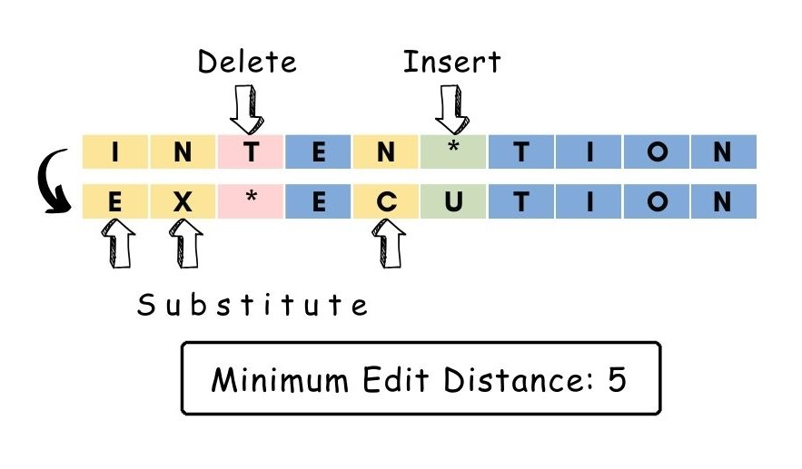
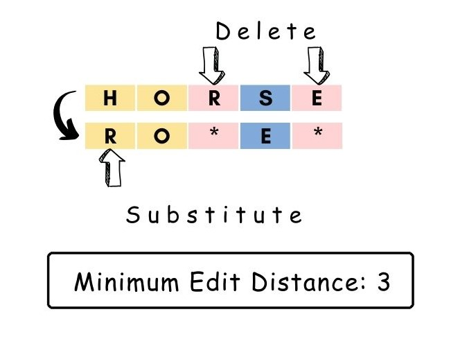

# Wagner-Fischers-Algorithm: Minimum Edit Distance
The Wagner-Fischer algorithm is a dynamic programming approach used to compute the edit distance between two strings needed to transform one string into another. The edit distance between two strings gives the measure of how alike or similar two strings are to each other. It refers to the minimum number of operations—
* Insertions: Adding a new character to a string.
* Deletions: Removing a character from a string.
* Substitutions: Replacing one character with another in a string.

The minimum edit distance is also known as the Levenshtein distance.

## Complexity Analysis
Time Complexity -> O(m*n)  
Space Complexity -> O(m*n)  
where m is the length of str1 and n is the length of str2.  

The bottom-up dynamic programming approach, or the Wagner-Fisher Algorithm, is indeed more efficient than the top-down approach because it avoids the overhead of recursion and utilizes a tabulation technique to build the solution iteratively. By iteratively building the solution from smaller subproblems to larger ones, the bottom-up approach ensures that each subproblem is solved exactly once, eliminate redundancy by calculating and reusing values in a tabulated manner. Additionally, the tabulation technique used in the bottom-up approach lends itself well to parallelization, making it suitable for parallel computing environments where multiple computations can be performed simultaneously. Overall, the bottom-up approach is preferred for its efficiency, especially in scenarios where performance and scalability are critical.
So, the programs are implemented using Bottom-up approach in python `wagner_fischer.py` also implemeented in c `wagner_fischer.c` and c++ `wagner_fischer.cpp`

For more details of the algorithm in top-down approach, refer my medium Blog -> [Wagner-Fischer algorithm](https://en.wikipedia.org/wiki/Wagner%E2%80%93Fischer_algorithm)

## Examples
   

   

## Applications of the Wagner-Fischer Algorithm
The Wagner-Fischer algorithm, is a versatile tool and fundamental algorithm with numerous practical applications. One key application is in spell checking and autocorrect systems, where it suggests corrections for misspelled words by finding the shortest path (minimum edit distance) between the misspelled word and correct words. The algorithm is instrumental in plagiarism detection, comparing two texts to detect similarities and potential plagiarism by calculating the edit distance between them. In bioinformatics, the algorithm plays a crucial role in DNA sequencing, comparing DNA sequences to determine their similarity, aiding in evolutionary studies and identifying genetic mutations. In OCR (Optical Character Recognition) systems, the algorithm helps recognize and correct errors in scanned text by comparing it to a database of correct words or phrases. The algorithm finds use in data cleaning and similarity analysis, identifying similar records or entities in data processing by calculating the edit distance between them. In speech recognition systems, it corrects errors by comparing the recognized text with the expected text, and in machine translation, it aligns words or phrases in different languages to improve translation quality. Lastly, in computational biology, the algorithm is employed in various tasks such as comparing protein sequences, predicting RNA secondary structures, and aligning DNA sequences, showcasing its broad utility across diverse fields.
